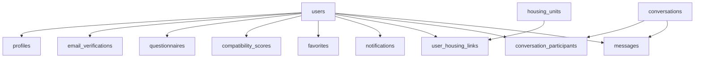
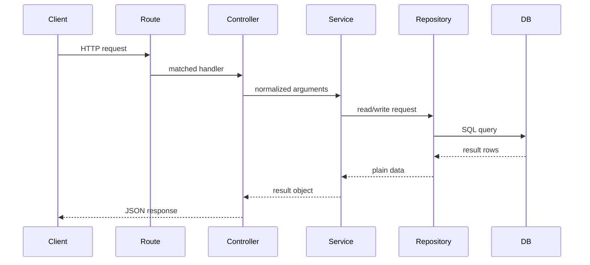

# BruinNest

BruinNest is a roommate-matching web app for UCLA students looking for compatible roommates and housing options near campus.

The current repository scope includes:

- Phase 1 / MVP: `US-1` through `US-5`
- Phase 2 / current enhancement scope: `US-6`, `US-7`, `US-8`, `US-9`, and `US-12`
- avatar upload as a profile extension within `US-2`

Core product areas include:

- account registration and login
- profile creation, update, and avatar upload
- browse and search
- roommate detail page
- direct messaging
- compatibility questionnaire and score display
- favorites and notifications
- housing search, housing linking, and map-based discovery

## Planned Stack

- frontend: `React`, `Vite`, `JavaScript`, `React Router`, `fetch`, `TanStack Query`
- backend: `Node.js`, `Express`, `SQLite`, `better-sqlite3`
- auth: `express-session`
- uploads: `multipart/form-data` with server-side file handling
- map support: local housing dataset plus frontend map rendering

## Architecture Diagrams

### Database Entity Relationships

The system has 12 tables organized around six domains: accounts, profiles, messaging, compatibility, discovery (favorites + notifications), and housing. `users` is the central identity anchor; all feature tables branch from it. Messaging flows through `conversations` → `conversation_participants` and `conversations` → `messages`.



### Backend Request Flow

Every authenticated request travels through five layers with a strict one-directional dependency rule: Route → Controller → Service → Repository → Database. Routes register endpoints and attach middleware. Controllers parse request data and delegate to services. Services enforce business rules and coordinate repositories. Repositories own all SQL. This layering keeps routing, business logic, and persistence cleanly separated and makes the codebase safe for multiple teammates to work on different modules concurrently.



## Documentation

Project specifications and architecture notes live in `docs/`. These documents were initially drafted with AI assistance and then manually reviewed and adjusted to match our project's specifics.

Key documents:

- `docs/bruinnest-user-story.md`
- `docs/bruinnest-database-spec.md`
- `docs/bruinnest-api-spec.md`
- `docs/bruinnest-backend-architecture.md`
- `docs/bruinnest-frontend-architecture.md`
- `docs/git-convention.md`
- `docs/README.md`

## Repository Layout

```text
bruinnest/
├── client/   # frontend application
├── server/   # backend application
└── docs/     # project specifications and architecture notes
```

Empty directories are tracked with `.gitkeep` during initialization.

## Current Status

This repository now includes:

- a Vite + React frontend in `client/`
- an Express + SQLite backend in `server/`
- demo seed data for local development and product walkthroughs
- a local housing dataset in `server/database/import-data/westwood-rentals.json`
- detailed database, API, backend, and frontend documentation in `docs/`

## Getting Started

Frontend:

```bash
cd client
npm install
npm run dev
```

Backend:

```bash
cd server
npm install
cp .env.example .env
npm run db:reset
npm run dev
```

Use `npm run db:reset` for the first local setup and whenever you want a clean demo database. It runs, in order: `db:clean`, `housing:import`, and `db:seed`.

### Database scripts

Run these from `server/`:

| Command | Purpose |
|---------|---------|
| `npm run db:reset` | Full reset: delete DB/uploads, import housing, seed demo data |
| `npm run db:clean` | Delete the SQLite database and uploaded avatars |
| `npm run housing:import` | Import listings from `database/import-data/westwood-rentals.json` |
| `npm run db:seed` | Copy seed avatars and load `database/seed.sql` |

`db:seed` assumes housing listings already exist. For a fresh database, use `db:reset` instead of `db:seed` alone.

### Demo account

After seeding, log in with:

- **Email:** `alice@ucla.edu`
- **Password:** `Password123!`

All seeded accounts share the same password. Alice is the primary demo user and includes preloaded browse matches, compatibility scores, favorites, notifications, map markers (via linked roommates), and message threads.

Other seeded users are background profiles for browse, map, and compatibility demos. Avatar placeholders live in `server/database/seed-assets/avatars/` and are copied into `server/uploads/avatars/` during `db:seed`.

Backend notes:

- Copy `.env.example` to `.env` before starting the server for the first time.
- `DATABASE_PATH` is resolved relative to the `server/` directory when you run backend commands there.
- The backend automatically initializes the SQLite database from `database/schema.sql` on startup.
- Demo seed data covers users, profiles, questionnaires, compatibility scores, favorites, notifications, housing links, messaging, and avatar placeholders.
- Update `SESSION_SECRET` in `.env` before shared testing or deployment. Do not keep the default `change-me` value.

Frontend notes:

- Configure the frontend API base URL in `client/.env` if needed.
- The frontend should send authenticated requests with credentials enabled.
- Phase 2 screens such as questionnaire, favorites, housing, and map discovery depend on the newer API and database contracts described in `docs/`.

## E2E Testing

End-to-end tests use [Playwright](https://playwright.dev/) and live in `e2e/`. From the `bruinnest/` root, a single command starts both servers, runs all 10 tests, and shuts everything down:

```bash
npm install
npm run test:e2e
```

On Linux/WSL, install Chromium system dependencies once before running:

```bash
npx playwright install-deps chromium
```

### Test coverage

| # | Feature | What it verifies |
|---|---------|-----------------|
| 1 | Auth | Register triggers verification email step |
| 2 | Auth | Login with valid credentials redirects to browse |
| 3 | Auth | Login with wrong password shows error |
| 4 | Routing | Unauthenticated access to `/browse` redirects to login |
| 5 | Browse | Profile listings are visible after login |
| 6 | Browse | Search by name filters results correctly |
| 7 | Favorites | Favorites page loads for authenticated user |
| 8 | Questionnaire | Questionnaire page loads with dropdown questions |
| 9 | Housing | Housing page loads with search form |
| 10 | Messages | Messages page loads conversation layout |

## Design Decisions

The table below summarizes the key architectural choices, the alternatives that were considered, and the rationale behind each decision.

| Decision | Alternatives considered | Why this choice |
|----------|------------------------|-----------------|
| **SQLite + better-sqlite3** for persistence | PostgreSQL, MongoDB | Zero-config local setup — no separate database server to install or manage. Synchronous API (`better-sqlite3`) keeps queries simple and avoids callback complexity, which is appropriate for a course-project workload. |
| **Session-based auth** (express-session) | JWT, OAuth 2.0 | Sessions are simpler to reason about and natively supported by Express. No token refresh or client-side storage logic needed. The frontend only needs `credentials: "include"` on fetch calls. |
| **Polling** for messages and notifications | WebSocket (Socket.io), Server-Sent Events | Keeps transport complexity minimal for the current project scope. `TanStack Query`'s built-in `refetchInterval` makes polling trivial to configure and centralize. The decision is documented as an intentional tradeoff — WebSocket can be introduced later without changing the API contract. |
| **Local housing dataset** (imported from JSON) | Live Zillow/RentCast API, Google Maps Places API | Avoids API key management, rate limits, and network dependency during development and demo. Data is curated and deterministic, which also makes E2E tests reliable. |
| **Cached compatibility scores** in `compatibility_scores` table | Recalculate on every browse request | Browsing and sorting by compatibility would require N×N pairwise comparisons per request. Caching scores on questionnaire submission keeps browse queries fast and allows batch recalculation when the scoring formula changes. |
| **Five-layer backend** (routes → controllers → services → repositories → DB) | Flat Express handlers with inline SQL, classic MVC | Enforces a strict dependency direction: repositories never call services, services never touch HTTP concepts. This makes the codebase safe for 3+ teammates to work on different modules concurrently without merge conflicts in business logic. |
| **TanStack Query** for server state | Redux, hand-written `useEffect` + `fetch` | Built-in caching, background refetch, polling (`refetchInterval`), and mutation invalidation eliminate hundreds of lines of boilerplate. Domain-specific `queryKeys.js` and `*Invalidation.js` files make cache coordination explicit and grep-able. The migration from manual hooks to TanStack Query was done with AI assistance. |
| **Feature-based frontend organization** | Flat `components/` folder, page-only structure | Each feature domain (messages, favorites, housing, etc.) owns its own `components/`, `hooks/`, and `queries/` sub-layers. Pages import hooks and components but never touch `queries/` directly, keeping the data-fetching layer opaque and replaceable. |
| **Unidirectional dependency flow** (frontend and backend) | Circular imports, shared utility modules that import from features | Both architecture docs explicitly enumerate allowed and disallowed dependencies. `shared/` modules must not import from `features/`. Repositories must not import services. This prevents the codebase from developing hidden coupling over time. |
| **`external_id`-based housing deduplication** | Auto-increment-only primary keys, upsert-by-address | Allows safe re-import of the housing catalog without creating duplicate listings. `external_id` is sourced from the original listing provider and remains stable across imports. |

## Product Scope Notes

The current planned implementation keeps two user stories deferred for a later phase:

- `US-10` Roommate Group / Housing Party
- `US-11` Roommate Agreement Template Generator

The current design also intentionally keeps polling as the update strategy for messages and notifications rather than introducing WebSocket transport.
