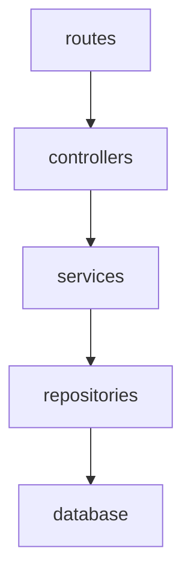
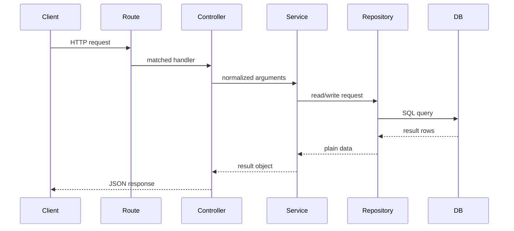

# BruinNest Backend Architecture

## 1. Document Purpose

This document defines the backend architecture for the BruinNest MVP. It is intended to serve as the internal implementation guide for the team after the MVP API specification has been finalized.

The scope of this document covers the backend implementation of `US-1` through `US-5`:

- account registration and login
- profile creation and update
- browse and search
- roommate detail page
- direct messaging

This document focuses on internal backend structure rather than external API behavior. External request and response contracts are defined in `bruinnest-mvp-spec.md`.

## 2. Architecture Goals

The backend architecture should satisfy the following goals:

1. Keep responsibilities separated so that routing, business logic, and database access do not become mixed together.
2. Make it easy for multiple teammates to work on different backend modules at the same time.
3. Keep the codebase simple enough for an MVP while leaving room for later expansion.
4. Support stable internal module boundaries so implementation details can change without affecting unrelated modules.
5. Match the current stack choice: `Node.js`, `Express`, `SQLite`, `better-sqlite3`, `express-session`, and `bcrypt`.

## 3. Layered Architecture

The backend uses a layered structure based on four logical parts:

1. `routes`
2. `controllers`
3. `services`
4. `repositories`

Although this can be described informally as a three-layer architecture of routing, business, and database, the controller layer is separated from route registration so HTTP handling stays clean.

### 3.1 Layer Responsibilities

#### `routes`

Purpose:

- define endpoint paths and HTTP methods
- attach middleware
- map each endpoint to a controller function

Rules:

- do not write SQL here
- do not implement business rules here
- do not directly shape database queries here

#### `controllers`

Purpose:

- read `req.params`, `req.query`, `req.body`, and session state
- call the appropriate service function
- translate service output into HTTP JSON responses
- forward errors to centralized error handling

Rules:

- controllers may validate request shape if validation middleware is not used
- controllers should not contain SQL
- controllers should not contain core business rules

#### `services`

Purpose:

- implement business logic
- enforce application rules
- coordinate multiple repositories
- prepare stable result objects for controllers

Examples:

- preventing duplicate registration
- enforcing verification-code resend cooldown
- deciding whether a profile is browseable
- ensuring a user cannot start a conversation with themselves
- computing unread counts

Rules:

- services must not directly read from `req` or write to `res`
- services should not depend on Express-specific APIs
- services may call one or more repositories

#### `repositories`

Purpose:

- perform database reads and writes
- isolate SQL statements and table-specific persistence logic

Rules:

- repositories should not contain HTTP concepts
- repositories should not implement application-level workflows
- repositories should return plain JavaScript objects or primitive values

## 4. Dependency Direction

Dependencies should flow in one direction only:



Allowed dependencies:

- `routes -> controllers`
- `controllers -> services`
- `services -> repositories`
- `services -> utils`
- `controllers -> utils`
- `repositories -> config/db`

Disallowed dependencies:

- `repositories -> services`
- `repositories -> controllers`
- `services -> routes`
- `services -> req/res`
- `controllers -> database` for direct SQL

## 5. Recommended Directory Structure

```text
server/
├── src/
│   ├── app.js
│   ├── server.js
│   ├── config/
│   │   ├── env.js
│   │   └── db.js
│   ├── routes/
│   │   ├── authRoutes.js
│   │   ├── profileRoutes.js
│   │   └── messageRoutes.js
│   ├── controllers/
│   │   ├── authController.js
│   │   ├── profileController.js
│   │   └── messageController.js
│   ├── services/
│   │   ├── authService.js
│   │   ├── profileService.js
│   │   └── messageService.js
│   ├── repositories/
│   │   ├── userRepository.js
│   │   ├── emailVerificationRepository.js
│   │   ├── profileRepository.js
│   │   ├── conversationRepository.js
│   │   └── messageRepository.js
│   ├── middlewares/
│   │   ├── requireAuth.js
│   │   ├── errorHandler.js
│   │   └── notFoundHandler.js
│   ├── validations/
│   │   ├── authValidation.js
│   │   ├── profileValidation.js
│   │   └── messageValidation.js
│   ├── utils/
│   │   ├── password.js
│   │   ├── time.js
│   │   └── apiResponse.js
│   └── errors/
│       ├── AppError.js
│       ├── AuthError.js
│       ├── ValidationError.js
│       └── NotFoundError.js
└── database/
    ├── schema.sql
    └── seed.sql
```

## 6. Module Responsibilities

## 6.1 Auth Module

Files:

- `routes/authRoutes.js`
- `controllers/authController.js`
- `services/authService.js`
- `repositories/userRepository.js`
- `repositories/emailVerificationRepository.js`

Responsibilities:

- begin registration
- send verification code
- verify registration
- log in
- log out
- return current authenticated user

Business rules owned by this module:

- email must be unique
- password must satisfy the agreed rule
- verification code resend interval is 60 seconds
- only valid verification codes can complete registration
- only verified accounts may log in

## 6.2 Profile Module

Files:

- `routes/profileRoutes.js`
- `controllers/profileController.js`
- `services/profileService.js`
- `repositories/profileRepository.js`

Responsibilities:

- create initial profile
- update profile
- read current user's profile
- return public browse/search results
- return public profile detail

Business rules owned by this module:

- only authenticated users may manage profile data
- only completed profiles appear in browse/search results
- current user should not appear in their own browse results
- search and filters should be handled on the backend

## 6.3 Message Module

Files:

- `routes/messageRoutes.js`
- `controllers/messageController.js`
- `services/messageService.js`
- `repositories/conversationRepository.js`
- `repositories/messageRepository.js`

Responsibilities:

- create or return one-to-one conversation
- list conversations
- fetch message history
- send message
- mark conversation as read
- return unread summary

Business rules owned by this module:

- a user cannot message themselves
- a user may only access conversations they belong to
- message history must be returned in chronological order
- unread count must be based on per-user read state

## 7. Internal Interface Conventions

Internal module interfaces should be documented and kept stable. These are not public HTTP APIs, but development contracts between backend modules.

General rules:

1. Controllers call services using plain values, not raw request objects.
2. Services call repositories using explicit parameters, not large unstructured objects unless the payload naturally belongs together.
3. Repositories return plain objects, arrays, or `null`.
4. Services throw typed application errors when a business rule fails.
5. Controllers are responsible for converting those errors into HTTP responses.

## 8. Export Contracts By Module

The following interfaces define the recommended export surface for each service and repository module.

## 8.1 Service Exports

### `authService.js`

Recommended exports:

- `sendVerificationCode({ email, password })`
- `verifyRegistration({ email, password, code, session })`
- `login({ email, password, session })`
- `logout(session)`
- `getCurrentUser(session)`

Return expectations:

- successful functions return plain result objects
- business failures throw typed errors such as `AuthError` or `ValidationError`

Notes:

- passing `session` into the service is acceptable because session creation and destruction are part of authentication workflow
- the service should still avoid handling full Express request and response objects

### `profileService.js`

Recommended exports:

- `createProfile(userId, profileData)`
- `getMyProfile(userId)`
- `updateMyProfile(userId, profileData)`
- `searchProfiles(currentUserId, searchParams)`
- `getPublicProfile(currentUserId, targetUserId)`

Return expectations:

- return normalized profile objects suitable for controller responses
- throw `NotFoundError` when the requested profile does not exist
- throw `ValidationError` if profile data is invalid

### `messageService.js`

Recommended exports:

- `createOrGetConversation(currentUserId, targetUserId)`
- `listConversations(currentUserId)`
- `listMessages(currentUserId, conversationId, afterMessageId)`
- `sendMessage(currentUserId, conversationId, body)`
- `markConversationRead(currentUserId, conversationId, lastReadMessageId)`
- `getUnreadSummary(currentUserId)`

Return expectations:

- return plain message and conversation objects
- throw `AuthError` or `NotFoundError` when access is invalid

## 8.2 Repository Exports

### `userRepository.js`

Recommended exports:

- `findById(userId)`
- `findByEmail(email)`
- `createUser({ email, passwordHash, isVerified })`
- `markVerified(userId)`

### `emailVerificationRepository.js`

Recommended exports:

- `findLatestActiveByEmail(email)`
- `createVerification({ email, codeHash, expiresAt, sentAt })`
- `markConsumed(verificationId, consumedAt)`
- `deleteExpired(now)`

### `profileRepository.js`

Recommended exports:

- `findByUserId(userId)`
- `createProfile(profileData)`
- `updateProfile(userId, profileData)`
- `searchProfiles(filters)`
- `findPublicProfileByUserId(userId)`

### `conversationRepository.js`

Recommended exports:

- `findDirectConversation(userAId, userBId)`
- `createConversation({ createdAt, updatedAt })`
- `addParticipant({ conversationId, userId, joinedAt })`
- `listConversationsForUser(userId)`
- `findParticipant(conversationId, userId)`
- `updateLastReadMessage({ conversationId, userId, lastReadMessageId })`
- `touchConversation(conversationId, updatedAt)`

### `messageRepository.js`

Recommended exports:

- `createMessage({ conversationId, senderUserId, body, createdAt })`
- `listMessages(conversationId)`
- `listMessagesAfter(conversationId, afterMessageId)`
- `findLatestMessage(conversationId)`
- `countUnreadMessages(conversationId, userId, lastReadMessageId)`
- `countAllUnreadMessagesForUser(userId)`

## 9. Error Handling Contract

Backend modules should use a consistent error model.

Recommended pattern:

- repositories return data or `null`
- services decide whether missing data is acceptable
- services throw typed application errors
- controllers pass errors to centralized middleware

Example error categories:

- `ValidationError`
- `AuthError`
- `NotFoundError`
- `ConflictError`

This avoids mixing error behavior across modules and keeps API responses consistent.

## 10. Validation Strategy

Validation should happen before business logic is executed.

Recommended rule:

- request shape validation happens in validation helpers or middleware
- business rule validation happens in services

Examples:

- request field missing: validation layer
- password does not contain a digit: service layer or validation layer, but choose one rule and keep it consistent
- user tries to create a conversation with themselves: service layer

## 11. Request Flow

The expected request flow is:



## 12. Naming Conventions

Use the following conventions consistently:

- route files: `authRoutes.js`
- controller files: `authController.js`
- service files: `authService.js`
- repository files: `userRepository.js`
- middleware files: `requireAuth.js`

Function naming:

- controller functions: verb-based, HTTP-oriented
  - `register`
  - `login`
  - `getMyProfile`
  - `sendMessage`
- service functions: business-oriented
  - `createOrGetConversation`
  - `searchProfiles`
- repository functions: data-oriented
  - `findByEmail`
  - `createMessage`
  - `listMessagesAfter`

## 13. Implementation Order

Recommended backend build order:

1. database connection and schema setup
2. error classes and common response helpers
3. auth module
4. profile module
5. messaging module
6. unread summary and polling support

This order matches the MVP dependency chain and minimizes rework.

## 14. Team Coordination Notes

For team collaboration, each module should be implemented against the agreed internal exports before integration starts.

Recommended practice:

1. freeze the service and repository function names before coding begins
2. assign modules by feature, not by file type only
3. avoid changing exported function signatures without team agreement
4. keep SQL inside repositories only
5. keep route handlers thin

## 15. Summary

The recommended backend structure for BruinNest MVP is:

- `routes` for endpoint registration
- `controllers` for HTTP handling
- `services` for business logic
- `repositories` for database access

This architecture is simple enough for the MVP, clear enough for team collaboration, and extensible enough for later features beyond `US-1` through `US-5`.
