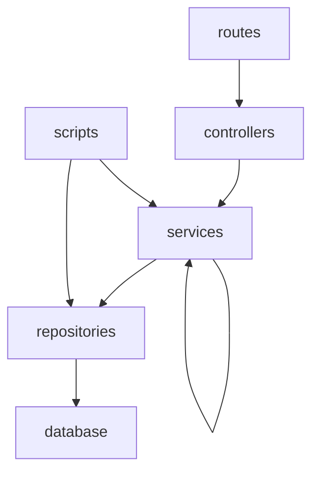
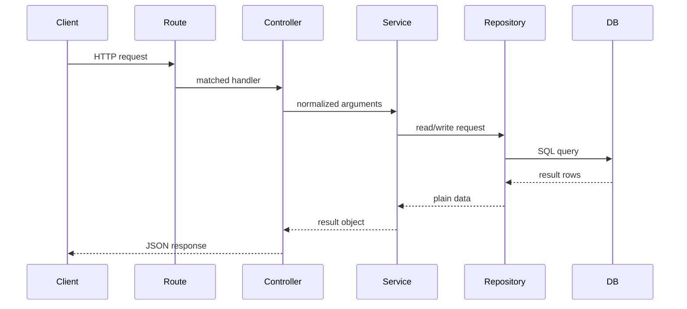
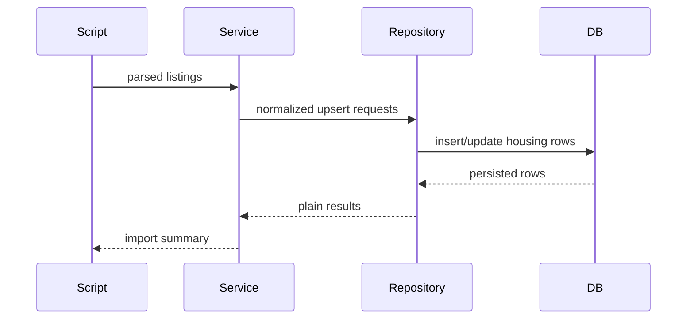

# BruinNest Backend Architecture

## 1. Document Purpose

This document defines the backend architecture for BruinNest across both the completed MVP and the current enhancement scope. It serves as the internal implementation guide for the team after the API and database specifications have been aligned.

The scope of this document covers backend implementation for:

- `US-1` through `US-5` in Phase 1 / MVP
- `US-6`, `US-7`, `US-8`, `US-9`, and `US-12` in the current Phase 2 scope
- avatar upload as a profile extension within `US-2`

This document focuses on internal backend structure rather than external API behavior. External request and response contracts are defined in `bruinnest-api-spec.md`.

## 2. Architecture Goals

The backend architecture should satisfy the following goals:

1. Keep responsibilities separated so that routing, business logic, file handling, and database access do not become mixed together.
2. Make it easy for multiple teammates to work on different backend modules at the same time.
3. Keep the codebase simple enough for a course project while leaving room for later expansion.
4. Support stable internal module boundaries so implementation details can change without affecting unrelated modules.
5. Match the current stack choice: `Node.js`, `Express`, `SQLite`, `better-sqlite3`, `express-session`, `bcrypt`, and `multer`.
6. Support polling-based messaging and notifications without introducing unnecessary transport complexity.
7. Support local housing data import and compatibility-score recalculation without leaking those workflows into controllers.

## 3. Layered Architecture

The backend uses a layered structure based on five logical parts:

1. `routes`
2. `controllers`
3. `services`
4. `repositories`
5. `scripts`

Although this can be described informally as a three-layer architecture of routing, business, and database, the controller layer remains separate from route registration, and scripts are treated as a controlled entry point for import and seed workflows.

### 3.1 Layer Responsibilities

#### `routes`

Purpose:

- define endpoint paths and HTTP methods
- attach middleware
- attach upload middleware where needed
- map each endpoint to a controller function

Rules:

- do not write SQL here
- do not implement business rules here
- do not directly shape database queries here

#### `controllers`

Purpose:

- read `req.params`, `req.query`, `req.body`, `req.file`, and session state
- call the appropriate service function
- translate service output into HTTP JSON responses
- forward errors to centralized error handling

Rules:

- controllers may validate request shape if validation middleware is not used
- controllers should not contain SQL
- controllers should not contain core business rules
- controllers should keep file-upload handling limited to extracting normalized arguments from middleware output

#### `services`

Purpose:

- implement business logic
- enforce application rules
- coordinate one or more repositories
- coordinate narrow cross-module workflows such as notification creation or compatibility recalculation
- prepare stable result objects for controllers

Examples:

- preventing duplicate registration
- enforcing verification-code resend cooldown
- deciding whether a profile is browseable
- ensuring a user cannot start a conversation with themselves
- computing unread counts
- recalculating compatibility scores after questionnaire updates
- creating notifications after messages, high matches, or favorites
- linking a housing unit to a user profile

Rules:

- services must not directly read from `req` or write to `res`
- services should not depend on Express-specific APIs
- services may call one or more repositories
- services may call another service only for narrow coordination concerns and must avoid cyclic dependencies

#### `repositories`

Purpose:

- perform database reads and writes
- isolate SQL statements and table-specific persistence logic

Rules:

- repositories should not contain HTTP concepts
- repositories should not implement application-level workflows
- repositories should return plain JavaScript objects, arrays, primitive values, or `null`

#### `scripts`

Purpose:

- run controlled backend workflows that are not request-driven
- seed the database
- import housing catalog data from local source files

Rules:

- scripts may orchestrate services or repositories, but should not duplicate service business rules
- scripts should be explicit entry points, not hidden side effects during normal app startup

## 4. Dependency Direction

Dependencies should flow in one direction only:



Allowed dependencies:

- `routes -> controllers`
- `controllers -> services`
- `controllers -> utils`
- `services -> repositories`
- `services -> services` for narrow coordination only
- `services -> utils`
- `repositories -> config/db`
- `scripts -> services`
- `scripts -> repositories`
- `scripts -> config/db`

Disallowed dependencies:

- `repositories -> services`
- `repositories -> controllers`
- `services -> routes`
- `services -> req/res`
- `controllers -> database` for direct SQL
- `routes -> repositories`

### 4.1 Cross-Module Coordination Rule

Phase 2 introduces two coordination-heavy workflows:

1. message, questionnaire, and favorite actions may create notifications
2. questionnaire writes may trigger compatibility-score recalculation

To keep those concerns centralized:

- notification creation should be owned by `notificationService`
- compatibility score writes should be owned by `questionnaireService` together with `compatibilityScoreRepository`
- other services may call those coordination services, but cycles must be avoided

## 5. Recommended Directory Structure

```text
server/
├── src/
│   ├── app.js
│   ├── server.js
│   ├── config/
│   │   ├── env.js
│   │   └── db.js
│   ├── routes/
│   │   ├── authRoutes.js
│   │   ├── profileRoutes.js
│   │   ├── messageRoutes.js
│   │   ├── questionnaireRoutes.js
│   │   ├── notificationRoutes.js
│   │   ├── favoriteRoutes.js
│   │   └── housingRoutes.js
│   ├── controllers/
│   │   ├── authController.js
│   │   ├── profileController.js
│   │   ├── messageController.js
│   │   ├── questionnaireController.js
│   │   ├── notificationController.js
│   │   ├── favoriteController.js
│   │   └── housingController.js
│   ├── services/
│   │   ├── authService.js
│   │   ├── profileService.js
│   │   ├── messageService.js
│   │   ├── questionnaireService.js
│   │   ├── notificationService.js
│   │   ├── favoriteService.js
│   │   └── housingService.js
│   ├── repositories/
│   │   ├── userRepository.js
│   │   ├── emailVerificationRepository.js
│   │   ├── profileRepository.js
│   │   ├── conversationRepository.js
│   │   ├── messageRepository.js
│   │   ├── questionnaireRepository.js
│   │   ├── compatibilityScoreRepository.js
│   │   ├── notificationRepository.js
│   │   ├── favoriteRepository.js
│   │   └── housingRepository.js
│   ├── middlewares/
│   │   ├── requireAuth.js
│   │   ├── errorHandler.js
│   │   └── notFoundHandler.js
│   ├── validations/
│   │   ├── commonValidation.js
│   │   ├── authValidation.js
│   │   ├── profileValidation.js
│   │   ├── messageValidation.js
│   │   ├── questionnaireValidation.js
│   │   ├── favoriteValidation.js
│   │   └── housingValidation.js
│   ├── utils/
│   │   ├── password.js
│   │   ├── time.js
│   │   ├── apiResponse.js
│   │   ├── compatibility.js
│   │   └── upload.js
│   └── errors/
│       ├── AppError.js
│       ├── AuthError.js
│       ├── ValidationError.js
│       ├── NotFoundError.js
│       └── ConflictError.js
└── scripts/
    ├── seedDb.js
    └── importHousingData.js
```

## 6. Module Responsibilities

## 6.1 Auth Module

Files:

- `routes/authRoutes.js`
- `controllers/authController.js`
- `services/authService.js`
- `repositories/userRepository.js`
- `repositories/emailVerificationRepository.js`
- `repositories/profileRepository.js`
- `validations/authValidation.js`
- `validations/commonValidation.js`

Responsibilities:

- begin registration
- send verification code
- verify registration
- log in
- log out
- return current authenticated user

Business rules owned by this module:

- email must be unique
- password must satisfy the agreed rule
- verification code resend interval is 60 seconds
- only valid verification codes can complete registration
- only verified accounts may log in
- login and session restore return `profileCompleted` from the profiles table so the frontend can route correctly

## 6.2 Profile Module (Extended in Phase 2)

Files:

- `routes/profileRoutes.js`
- `controllers/profileController.js`
- `services/profileService.js`
- `repositories/profileRepository.js`
- `repositories/userRepository.js`
- `repositories/favoriteRepository.js`
- `repositories/compatibilityScoreRepository.js`
- `repositories/housingRepository.js`
- `validations/profileValidation.js`
- `validations/commonValidation.js`
- `utils/upload.js`

Responsibilities:

- create initial profile
- update profile
- read current user's profile
- upload or replace avatar metadata
- return public browse/search results
- return public profile detail

Business rules owned by this module:

- only authenticated users may manage profile data
- only completed profiles appear in browse/search results
- current user should not appear in their own browse results
- search and filters should be handled on the backend
- avatar upload updates only `profiles.avatar_url`, not binary content in SQLite
- profile detail may aggregate compatibility, favorite, and linked-housing summaries without owning those underlying domains

## 6.3 Message Module

Files:

- `routes/messageRoutes.js`
- `controllers/messageController.js`
- `services/messageService.js`
- `services/notificationService.js`
- `repositories/conversationRepository.js`
- `repositories/messageRepository.js`
- `repositories/userRepository.js`
- `validations/messageValidation.js`
- `validations/commonValidation.js`

Responsibilities:

- create or return one-to-one conversation
- list conversations
- fetch message history
- send message
- mark conversation as read
- return unread summary

Business rules owned by this module:

- a user cannot message themselves
- a user may only access conversations they belong to
- message history must be returned in chronological order
- unread count must be based on per-user read state
- sending a message may trigger a notification for the recipient through `notificationService`

## 6.4 Questionnaire and Compatibility Module (Added in Phase 2)

Files:

- `routes/questionnaireRoutes.js`
- `controllers/questionnaireController.js`
- `services/questionnaireService.js`
- `services/notificationService.js`
- `repositories/questionnaireRepository.js`
- `repositories/compatibilityScoreRepository.js`
- `repositories/profileRepository.js`
- `validations/questionnaireValidation.js`
- `utils/compatibility.js`

Responsibilities:

- return the current user's questionnaire answers
- create or update questionnaire submissions
- calculate or recalculate compatibility scores
- return compatibility score lookups

Business rules owned by this module:

- a user has at most one active questionnaire record
- compatibility scores are recalculated when answers change
- score writes should stay symmetric when the implementation stores both directions
- high-match notifications should be created through `notificationService`, not directly from controllers

## 6.5 Notification Module (Added in Phase 2)

Files:

- `routes/notificationRoutes.js`
- `controllers/notificationController.js`
- `services/notificationService.js`
- `repositories/notificationRepository.js`
- `validations/commonValidation.js`

Responsibilities:

- list notifications
- mark one notification as read
- mark all notifications as read
- create notification rows for other backend modules

Business rules owned by this module:

- users may only read and update their own notifications
- notification type formatting should stay centralized
- write-side creation logic should be reused by message, questionnaire, and favorite workflows

## 6.6 Favorite Module (Added in Phase 2)

Files:

- `routes/favoriteRoutes.js`
- `controllers/favoriteController.js`
- `services/favoriteService.js`
- `services/notificationService.js`
- `repositories/favoriteRepository.js`
- `repositories/profileRepository.js`
- `validations/favoriteValidation.js`

Responsibilities:

- list the current user's favorites
- add a favorite
- remove a favorite

Business rules owned by this module:

- a user cannot favorite themselves
- duplicate favorites should be prevented
- favorite creation may trigger a notification through `notificationService`

## 6.7 Housing Module (Added in Phase 2)

Files:

- `routes/housingRoutes.js`
- `controllers/housingController.js`
- `services/housingService.js`
- `repositories/housingRepository.js`
- `repositories/profileRepository.js`
- `validations/housingValidation.js`
- `scripts/importHousingData.js`

Responsibilities:

- search the local housing catalog
- return the current user's linked housing unit
- create or replace the current user's housing link
- remove the current user's housing link
- return map-ready housing discovery data
- import curated housing data from local source files

Business rules owned by this module:

- runtime housing search should use local imported data, not live third-party API calls
- a user may link at most one housing unit at a time
- map results should only include valid linked units with coordinates
- import workflows should deduplicate listings by `external_id`

## 7. Internal Interface Conventions

Internal module interfaces should be documented and kept stable. These are not public HTTP APIs, but development contracts between backend modules.

General rules:

1. Controllers call services using plain values, not raw request objects.
2. Services call repositories using explicit parameters, not large unstructured objects unless the payload naturally belongs together.
3. Repositories return plain objects, arrays, or `null`.
4. Services throw typed application errors when a business rule fails.
5. Controllers are responsible for converting those errors into HTTP responses.
6. Cross-module service calls should stay narrow and one-directional.
7. File-upload middleware should produce normalized file metadata before the controller hands work to the service.

## 8. Export Contracts By Module

The following interfaces define the recommended export surface for each service and repository module.

## 8.1 Service Exports

### `authService.js`

Recommended exports:

- `sendVerificationCode({ email, password })`
- `verifyRegistration({ email, password, code, session })`
- `login({ email, password, session })`
- `logout(session)`
- `getCurrentUser(session)`

Return expectations:

- successful functions return plain result objects
- business failures throw typed errors such as `AuthError` or `ValidationError`

Notes:

- passing `session` into the service is acceptable because session creation and destruction are part of authentication workflow
- the service should still avoid handling full Express request and response objects

### `profileService.js`

Recommended exports:

- `createProfile(userId, profileData)`
- `getMyProfile(userId)`
- `updateMyProfile(userId, profileData)`
- `uploadMyAvatar(userId, fileMeta)`
- `searchProfiles(currentUserId, searchParams)`
- `getPublicProfile(currentUserId, targetUserId)`

Return expectations:

- return normalized profile objects suitable for controller responses
- throw `NotFoundError` when the requested profile does not exist
- throw `ValidationError` if profile data or upload metadata is invalid

### `messageService.js`

Recommended exports:

- `createOrGetConversation(currentUserId, targetUserId)`
- `listConversations(currentUserId)`
- `getMessages(currentUserId, conversationId, afterMessageId)`
- `sendMessage(currentUserId, conversationId, body)`
- `markConversationRead(currentUserId, conversationId, lastReadMessageId)`
- `getUnreadSummary(currentUserId)`

Return expectations:

- return plain message and conversation objects
- throw `AuthError`, `ValidationError`, or `NotFoundError` when access is invalid

### `questionnaireService.js`

Recommended exports:

- `getMyQuestionnaire(userId)`
- `upsertMyQuestionnaire(userId, answers)`
- `getCompatibilityScore(currentUserId, targetUserId)`
- `recalculateScoresForUser(userId)`

Return expectations:

- return normalized questionnaire and compatibility data
- throw `ValidationError` for malformed answers
- throw `NotFoundError` when a score lookup target does not exist

### `notificationService.js`

Recommended exports:

- `listNotifications(userId, params)`
- `markNotificationRead(userId, notificationId)`
- `markAllNotificationsRead(userId)`
- `createNotification(payload)`

Return expectations:

- return plain notification objects
- keep notification formatting and persistence orchestration centralized

### `favoriteService.js`

Recommended exports:

- `listFavorites(userId)`
- `addFavorite(userId, targetUserId)`
- `removeFavorite(userId, targetUserId)`

Return expectations:

- return normalized favorite card data
- throw `ValidationError` or `ConflictError` when favorite rules are violated

### `housingService.js`

Recommended exports:

- `searchHousing(params)`
- `getMyLinkedHousing(userId)`
- `linkMyHousing(userId, housingUnitId)`
- `unlinkMyHousing(userId)`
- `getHousingMapData(userId, params)`
- `importHousingCatalog(listings, options)`

Return expectations:

- return normalized housing and map marker objects
- throw `NotFoundError` when a requested housing unit does not exist

## 8.2 Repository Exports

### `userRepository.js`

Recommended exports:

- `findById(userId)`
- `findByEmail(email)`
- `createUser({ email, passwordHash, isVerified })`
- `markVerified(userId)`

### `emailVerificationRepository.js`

Recommended exports:

- `findLatestActiveByEmail(email)`
- `createVerification({ email, codeHash, expiresAt, sentAt })`
- `markConsumed(verificationId, consumedAt)`
- `deleteExpired(now)`

### `profileRepository.js`

Recommended exports:

- `findByUserId(userId)`
- `createProfile(profileData)`
- `updateProfile(userId, profileData)`
- `updateAvatar(userId, avatarUrl)`
- `searchProfiles(filters)`
- `findPublicProfileByUserId(userId)`

### `conversationRepository.js`

Recommended exports:

- `findDirectConversation(userAId, userBId)`
- `createConversation({ createdAt, updatedAt })`
- `addParticipant({ conversationId, userId, joinedAt })`
- `listConversationsForUser(userId)`
- `findParticipant(conversationId, userId)`
- `updateLastReadMessage({ conversationId, userId, lastReadMessageId })`
- `touchConversation(conversationId, updatedAt)`

### `messageRepository.js`

Recommended exports:

- `createMessage({ conversationId, senderUserId, body, createdAt })`
- `findMessageById(messageId)`
- `listMessages(conversationId)`
- `listMessagesAfter(conversationId, afterMessageId)`
- `findLatestMessage(conversationId)`
- `countUnreadMessages(conversationId, userId, lastReadMessageId)`
- `countAllUnreadMessagesForUser(userId)`

### `questionnaireRepository.js`

Recommended exports:

- `findByUserId(userId)`
- `upsertQuestionnaire({ userId, answers, createdAt, updatedAt })`
- `listCompletedQuestionnairesExcludingUser(userId)`

### `compatibilityScoreRepository.js`

Recommended exports:

- `findScore(userId, otherUserId)`
- `upsertScore({ userId, otherUserId, scorePercent, calculatedAt })`
- `replaceScoresForUser(userId, scores, calculatedAt)`
- `listScoresForUser(userId)`

### `notificationRepository.js`

Recommended exports:

- `createNotification(payload)`
- `listNotificationsForUser(userId, params)`
- `findById(notificationId)`
- `markRead(notificationId, readAt)`
- `markAllReadForUser(userId, readAt)`

### `favoriteRepository.js`

Recommended exports:

- `listFavoritesForUser(userId)`
- `findFavorite(userId, targetUserId)`
- `createFavorite({ userId, favoritedUserId, createdAt })`
- `deleteFavorite(userId, targetUserId)`

### `housingRepository.js`

Recommended exports:

- `searchHousing(params)`
- `findHousingById(housingUnitId)`
- `findHousingByExternalId(externalId)`
- `upsertHousingUnit(payload)`
- `findLinkedHousingForUser(userId)`
- `linkHousingToUser({ userId, housingUnitId, linkedAt, updatedAt })`
- `unlinkHousingForUser(userId)`
- `listMapCandidates(params)`

## 9. Error Handling Contract

Backend modules should use a consistent error model.

Recommended pattern:

- repositories return data or `null`
- services decide whether missing data is acceptable
- services throw typed application errors
- controllers pass errors to centralized middleware

Example error categories:

- `ValidationError`
- `AuthError`
- `NotFoundError`
- `ConflictError`

Common Phase 2 triggers:

- invalid avatar file type or file size
- questionnaire answers outside the allowed option set
- duplicate favorites
- linking a missing housing unit
- reading or updating another user's notifications

This avoids mixing error behavior across modules and keeps API responses consistent.

## 10. Validation Strategy

Validation should happen before business logic is executed.

Recommended rule:

- request shape validation happens in validation helpers or middleware
- multipart upload validation happens in upload middleware plus service checks
- business rule validation happens in services

Examples:

- request field missing: validation layer
- password does not contain a digit: validation layer or service layer, but choose one rule and keep it consistent
- user tries to create a conversation with themselves: service layer
- uploaded avatar is not an image: upload middleware or service layer
- housing link points to an unknown unit: service layer

## 11. Request Flow

The expected request flow is:



### 11.1 Import Flow

The expected import flow for housing data is:



## 12. Naming Conventions

Use the following conventions consistently:

- route files: `authRoutes.js`
- controller files: `authController.js`
- service files: `authService.js`
- repository files: `userRepository.js`
- middleware files: `requireAuth.js`
- scripts: `importHousingData.js`

Function naming:

- controller functions: verb-based and HTTP-oriented
  - `register`
  - `login`
  - `getMyProfile`
  - `uploadMyAvatar`
  - `sendMessage`
  - `getNotifications`
  - `linkMyHousing`
- service functions: business-oriented
  - `createOrGetConversation`
  - `searchProfiles`
  - `upsertMyQuestionnaire`
  - `markAllNotificationsRead`
  - `searchHousing`
- repository functions: data-oriented
  - `findByEmail`
  - `createMessage`
  - `listMessagesAfter`
  - `upsertScore`
  - `linkHousingToUser`

## 13. Implementation Order

Recommended backend build order:

1. database connection and schema setup
2. error classes and common response helpers
3. auth module
4. profile module
5. messaging module
6. questionnaire and compatibility module
7. favorites module
8. notification module
9. housing module and import script
10. avatar upload integration and final cross-module polish

This order keeps the original MVP dependency chain intact while adding Phase 2 features in a way that minimizes rework.

## 14. Team Coordination Notes

For team collaboration, each module should be implemented against the agreed internal exports before integration starts.

Recommended practice:

1. freeze the service and repository function names before coding begins
2. assign modules by feature, not by file type only
3. avoid changing exported function signatures without team agreement
4. keep SQL inside repositories only
5. keep route handlers thin
6. treat housing import as a script concern, not a hidden side effect of app startup
7. keep notification creation centralized so message, questionnaire, and favorite features do not each invent their own notification format

## 15. Summary

The recommended backend structure for BruinNest is:

- `routes` for endpoint registration
- `controllers` for HTTP handling
- `services` for business logic and narrow workflow orchestration
- `repositories` for database access
- `scripts` for seed and housing import workflows

This architecture preserves the original MVP layering while expanding cleanly for compatibility scoring, notifications, favorites, housing linkage, map discovery, and avatar upload.
