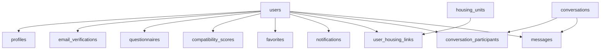

# BruinNest Database Specification

## 1. Document Purpose

This document defines the database specification for BruinNest across both the completed MVP and the current enhancement scope.

It covers the persistent data model for:

- `US-1` through `US-5` in Phase 1 / MVP
- `US-6`, `US-7`, `US-8`, `US-9`, and `US-12` in the current Phase 2 scope
- avatar upload as a profile extension within `US-2`

This document focuses on schema-level design decisions, entity relationships, and persistence rules. External API contracts are defined separately in `bruinnest-api-spec.md` until the API specification is expanded to match this database scope.

## 2. Scope

### 2.1 Included in the Current Database Model

The current database model supports the following functional areas:

1. account identity and authentication state
2. registration verification codes
3. public roommate profiles
4. avatar metadata for uploaded profile photos
5. browse/search eligibility
6. one-to-one conversations
7. message history
8. unread message tracking
9. compatibility questionnaire answers
10. compatibility score caching
11. saved roommate profiles
12. in-app notifications
13. housing listing catalog
14. user-linked housing units
15. map-ready housing location data

### 2.2 Deferred Beyond the Current Scope

The following features are intentionally excluded from the current data model:

- group matching / housing parties
- roommate agreement generation

The schema should remain simple enough for a course project while still supporting later expansion into those deferred features.

### 2.3 Additions Since MVP

Compared with the original Phase 1 / MVP schema, the current scope adds the following data-model changes:

- `profiles.avatar_url` for uploaded profile photos
- `questionnaires`
- `compatibility_scores`
- `favorites`
- `notifications`
- `housing_units`
- `user_housing_links`

These additions are called out again in the table specifications below so that readers can quickly distinguish the MVP foundation from Phase 2 extensions.

## 3. Technical Context

The database layer assumes the following stack:

- `SQLite`
- `better-sqlite3`
- backend runtime: `Node.js + Express`
- uploaded avatar files stored on the server filesystem, with metadata persisted in SQLite

The schema should remain explicit, readable, and easy to maintain, while still supporting richer product behavior beyond the original MVP.

## 4. Design Principles

The BruinNest database follows these principles:

1. Separate account identity from public profile data.
2. Keep browse visibility explicit through a dedicated completion flag.
3. Model messaging through conversations and participants instead of storing direct user-to-user message pairs only.
4. Keep persistence logic compatible with polling for messaging and notifications.
5. Store profile extensions and feature-specific data in separate tables when that keeps responsibilities clearer.
6. Cache compatibility scores so browse sorting and detail views do not recompute every comparison on demand.
7. Treat housing listings as a reusable catalog rather than embedding raw listing data into each profile.

## 5. Table Overview

The current database model includes the following tables:

- `users`
- `email_verifications`
- `profiles`
- `conversations`
- `conversation_participants`
- `messages`
- `questionnaires`
- `compatibility_scores`
- `favorites`
- `notifications`
- `housing_units`
- `user_housing_links`

## 6. Table Specifications

### 6.1 `users`

Purpose: stores account identity and authentication state.

Fields:

- `id` INTEGER PRIMARY KEY
- `email` TEXT NOT NULL UNIQUE
- `password_hash` TEXT NOT NULL
- `is_verified` INTEGER NOT NULL DEFAULT 0
- `created_at` TEXT NOT NULL
- `updated_at` TEXT NOT NULL

Notes:

- This table should remain authentication-focused.
- Public profile fields must not be stored here.
- Passwords must never be stored in plaintext.

### 6.2 `email_verifications`

Purpose: stores registration verification data and resend timing.

Fields:

- `id` INTEGER PRIMARY KEY
- `email` TEXT NOT NULL
- `code_hash` TEXT NOT NULL
- `expires_at` TEXT NOT NULL
- `sent_at` TEXT NOT NULL
- `consumed_at` TEXT NULL

Notes:

- Verification codes should be stored as hashes.
- The most recent unconsumed row for a given email is used during verification.
- Resend cooldown is enforced using `sent_at`.

### 6.3 `profiles` (Extended in Phase 2)

Purpose: stores the public roommate profile shown in browse and detail pages.

Fields:

- `id` INTEGER PRIMARY KEY
- `user_id` INTEGER NOT NULL UNIQUE
- `display_name` TEXT NOT NULL
- `gender` TEXT NOT NULL
- `graduation_year` INTEGER NOT NULL
- `budget_min` INTEGER NOT NULL
- `budget_max` INTEGER NOT NULL
- `move_in_date` TEXT NOT NULL
- `bio` TEXT NOT NULL
- `avatar_url` TEXT NULL
- `profile_completed` INTEGER NOT NULL DEFAULT 0
- `created_at` TEXT NOT NULL
- `updated_at` TEXT NOT NULL

Notes:

- `profile_completed` controls browse and search eligibility.
- `user_id` is a one-to-one reference to the account owner.
- `avatar_url` stores the server-accessible path or URL for the uploaded profile image, not the binary file contents.
- Later profile extensions can still be added here without changing the `users` table.

### 6.4 `conversations`

Purpose: stores a message thread.

Fields:

- `id` INTEGER PRIMARY KEY
- `created_at` TEXT NOT NULL
- `updated_at` TEXT NOT NULL

Notes:

- The current implementation supports one-to-one conversations, but this table remains generic so later group chat can be added if needed.

### 6.5 `conversation_participants`

Purpose: maps users to conversations and tracks read state.

Fields:

- `id` INTEGER PRIMARY KEY
- `conversation_id` INTEGER NOT NULL
- `user_id` INTEGER NOT NULL
- `last_read_message_id` INTEGER NULL
- `joined_at` TEXT NOT NULL

Constraints:

- UNIQUE (`conversation_id`, `user_id`)

Notes:

- Each current conversation should have exactly two participants.
- `last_read_message_id` supports unread-count calculation and incremental polling.

### 6.6 `messages`

Purpose: stores message history for each conversation.

Fields:

- `id` INTEGER PRIMARY KEY
- `conversation_id` INTEGER NOT NULL
- `sender_user_id` INTEGER NOT NULL
- `body` TEXT NOT NULL
- `created_at` TEXT NOT NULL

Notes:

- Messages must be returned chronologically.
- Each message belongs to exactly one conversation.

### 6.7 `questionnaires` (Added in Phase 2)

Purpose: stores each user's compatibility questionnaire answers.

Fields:

- `id` INTEGER PRIMARY KEY
- `user_id` INTEGER NOT NULL UNIQUE
- `sleep_schedule` TEXT NOT NULL
- `cleanliness_level` TEXT NOT NULL
- `noise_tolerance` TEXT NOT NULL
- `guest_policy` TEXT NOT NULL
- `study_habits` TEXT NOT NULL
- `smoking_preference` TEXT NOT NULL
- `drinking_preference` TEXT NOT NULL
- `sharing_preference` TEXT NOT NULL
- `pet_comfort` TEXT NOT NULL
- `communication_style` TEXT NOT NULL
- `created_at` TEXT NOT NULL
- `updated_at` TEXT NOT NULL

Notes:

- The exact question set can evolve, but the schema should represent stable answer categories rather than free-form essay responses.
- `user_id` remains one-to-one because each user should have at most one current questionnaire submission.

### 6.8 `compatibility_scores` (Added in Phase 2)

Purpose: caches pairwise compatibility scores between users who completed the questionnaire.

Fields:

- `id` INTEGER PRIMARY KEY
- `user_id` INTEGER NOT NULL
- `other_user_id` INTEGER NOT NULL
- `score_percent` INTEGER NOT NULL
- `calculated_at` TEXT NOT NULL

Constraints:

- UNIQUE (`user_id`, `other_user_id`)

Notes:

- Scores should usually be stored symmetrically for both directions (`A -> B` and `B -> A`) to keep lookup queries simple.
- `score_percent` should be constrained in application logic to the range `0` through `100`.

### 6.9 `favorites` (Added in Phase 2)

Purpose: stores saved roommate profiles for each user.

Fields:

- `id` INTEGER PRIMARY KEY
- `user_id` INTEGER NOT NULL
- `favorited_user_id` INTEGER NOT NULL
- `created_at` TEXT NOT NULL

Constraints:

- UNIQUE (`user_id`, `favorited_user_id`)

Notes:

- A user must not favorite themselves; this is enforced by application logic.
- This table supports both favorites-page rendering and favorite-triggered notifications.

### 6.10 `notifications` (Added in Phase 2)

Purpose: stores in-app notification items for users.

Fields:

- `id` INTEGER PRIMARY KEY
- `user_id` INTEGER NOT NULL
- `type` TEXT NOT NULL
- `title` TEXT NOT NULL
- `body` TEXT NOT NULL
- `reference_type` TEXT NULL
- `reference_id` INTEGER NULL
- `is_read` INTEGER NOT NULL DEFAULT 0
- `created_at` TEXT NOT NULL
- `read_at` TEXT NULL

Notes:

- Expected notification types include new messages, high-compatibility matches, and favorite-related events.
- `reference_type` and `reference_id` support deep-link behavior without requiring a separate table for each notification kind.

### 6.11 `housing_units` (Added in Phase 2)

Purpose: stores a local catalog of publicly available rental listings that users can link to their profiles.

Fields:

- `id` INTEGER PRIMARY KEY
- `external_id` TEXT NOT NULL UNIQUE
- `source` TEXT NOT NULL
- `name` TEXT NOT NULL
- `address_line` TEXT NOT NULL
- `city` TEXT NOT NULL
- `state` TEXT NOT NULL
- `zip` TEXT NOT NULL
- `neighborhood` TEXT NULL
- `lat` REAL NOT NULL
- `lng` REAL NOT NULL
- `monthly_rent` INTEGER NOT NULL
- `bedrooms` INTEGER NOT NULL
- `bathrooms` REAL NOT NULL
- `sqft` INTEGER NULL
- `property_type` TEXT NOT NULL
- `listing_url` TEXT NOT NULL
- `photo_urls_json` TEXT NOT NULL
- `created_at` TEXT NOT NULL
- `updated_at` TEXT NOT NULL

Notes:

- Listing records are imported from a curated local dataset rather than fetched live from a third-party API during normal app use.
- `photo_urls_json` stores a JSON array of image URLs to keep the schema lightweight for a course project.
- `lat` and `lng` are required because map-based display depends on them.

### 6.12 `user_housing_links` (Added in Phase 2)

Purpose: stores which housing unit a user currently links on their profile.

Fields:

- `id` INTEGER PRIMARY KEY
- `user_id` INTEGER NOT NULL UNIQUE
- `housing_unit_id` INTEGER NOT NULL
- `linked_at` TEXT NOT NULL
- `updated_at` TEXT NOT NULL

Notes:

- A user may link at most one current housing unit at a time.
- The separate link table avoids copying listing details into `profiles` and makes replacement/removal logic straightforward.

## 7. Relationship Summary

## 8. Core Data Rules

### 8.1 Account and Profile Separation

Authentication-related data lives in `users`. Public profile data lives in `profiles`. This separation keeps authentication logic isolated and makes profile evolution easier.

### 8.2 Browse Eligibility

A user appears in browse and search results only when all of the following are true:

- the account exists
- the account is verified
- a profile exists
- `profile_completed = 1`

This rule should be enforced by backend query logic, not just by frontend behavior.

### 8.3 Avatar Storage Rule

Uploaded avatar files should live on the server filesystem, while only the resulting file path or URL is stored in `profiles.avatar_url`.

### 8.4 Conversation Ownership

A user may access a conversation only if a matching row exists in `conversation_participants`.

### 8.5 Unread Tracking

Unread state is tracked per participant through `last_read_message_id`. This allows the system to support:

- per-conversation unread counts
- total unread summary for the navigation bar
- incremental polling
- notification generation on new messages

### 8.6 Questionnaire Ownership

Each user may have only one active questionnaire row. Updating the questionnaire should overwrite that row and trigger score recalculation against other questionnaire-complete users.

### 8.7 Compatibility Score Caching

Compatibility scores should be recalculated when:

- a user submits the questionnaire for the first time
- a user updates questionnaire answers
- the application changes the scoring formula in a way that requires a refresh

### 8.8 Favorites Rule

Favorites are directional:

- if user A favorites user B, that does not automatically mean user B favorites user A
- duplicate favorite rows are prevented by uniqueness constraints

### 8.9 Housing Link Rule

A user may have at most one active linked housing unit at a time, but many users may link the same housing unit from the shared catalog.

### 8.10 Map Eligibility

Map-based housing display should include only users who:

- have completed profiles
- have completed questionnaires when compatibility filtering is required
- have a linked housing unit with valid `lat` and `lng`

## 9. Extensibility Notes

The current schema intentionally leaves the following extension points open:

1. group matching can later add party tables without redesigning accounts, profiles, or housing tables
2. roommate agreement generation can be layered on top of questionnaire and messaging data
3. notification types can grow without adding a new table for every event source
4. conversation structure is already compatible with potential group messaging
5. housing listings can later include richer metadata if the project adopts a different dataset source

## 10. Implementation Notes

When the team creates or updates the SQL schema, the following should be reflected clearly:

- explicit uniqueness for account email
- explicit uniqueness for `profiles.user_id`
- explicit uniqueness for `conversation_participants (conversation_id, user_id)`
- explicit uniqueness for `questionnaires.user_id`
- explicit uniqueness for `compatibility_scores (user_id, other_user_id)`
- explicit uniqueness for `favorites (user_id, favorited_user_id)`
- explicit uniqueness for `housing_units.external_id`
- explicit uniqueness for `user_housing_links.user_id`
- all timestamp fields should be stored as ISO 8601 UTC text strings
- example format: `2026-05-14T17:00:00.000Z`
- indexes should be added where browse, favorites, notifications, housing search, or map lookup frequency justifies them
- foreign key relationships should be enabled consistently in SQLite

Recommended additional indexing targets:

- `messages (conversation_id, id)`
- `notifications (user_id, is_read, created_at)`
- `favorites (user_id, created_at)`
- `compatibility_scores (user_id, score_percent)`
- `housing_units (zip, neighborhood, monthly_rent)`

## 11. Summary

The BruinNest database model is now centered on six stable domains:

- accounts
- profiles
- messaging
- compatibility
- discovery and saved profiles
- housing and map data

This structure preserves the original MVP foundation while supporting the current Phase 2 enhancement scope without requiring a redesign of the core account, profile, or messaging tables.
