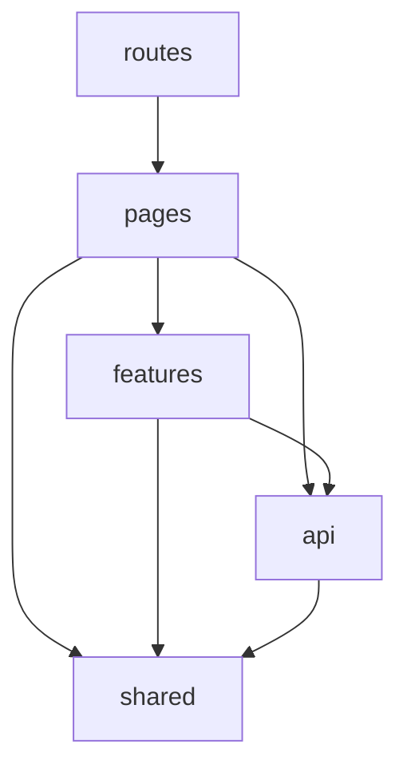
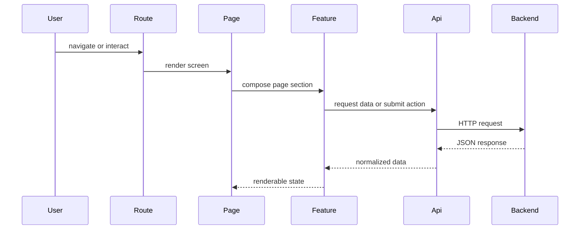
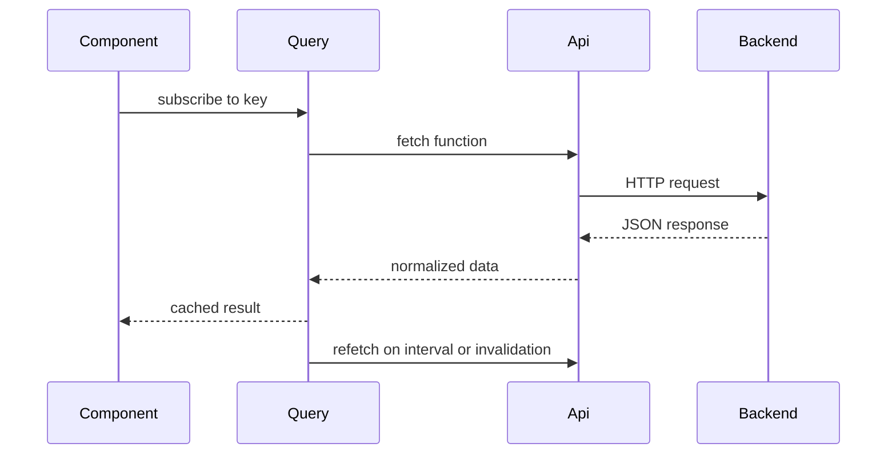

# BruinNest Frontend Architecture

## 1. Document Purpose

This document defines the frontend architecture for BruinNest across both the completed MVP and the current enhancement scope. It is intended to serve as the internal implementation guide for the team after the API specification has been aligned with the current product scope.

The scope of this document covers the frontend implementation of:

- `US-1` through `US-5` in Phase 1 / MVP
- `US-6`, `US-7`, `US-8`, `US-9`, and `US-12` in the current Phase 2 scope
- avatar upload as a profile extension within `US-2`

This document focuses on internal frontend structure rather than backend endpoint behavior. External request and response contracts are defined in `bruinnest-api-spec.md`.

## 2. Architecture Goals

The frontend architecture should satisfy the following goals:

1. Keep routing, page composition, UI rendering, and network requests clearly separated.
2. Make it easy for multiple teammates to work on different frontend modules at the same time.
3. Keep the codebase simple enough for a course project while leaving room for later expansion.
4. Support stable internal module boundaries so UI and data-fetching details can evolve without affecting unrelated parts of the app.
5. Match the current stack choice: `React`, `Vite`, `JavaScript`, `React Router`, `fetch`, and `TanStack Query`.
6. Support polling-based updates for messages and notifications without leaking timer logic across unrelated pages.
7. Support richer Phase 2 discovery flows such as questionnaire submission, favorites, housing linkage, and map browsing while keeping page files readable.

## 3. Layered Architecture

The frontend uses a layered structure based on five logical parts:

1. `routes`
2. `pages`
3. `features`
4. `api`
5. `shared`

This structure keeps page-level behavior separate from reusable UI, keeps HTTP requests out of page components, and keeps server-state orchestration centralized.

### 3.1 Layer Responsibilities

#### `routes`

Purpose:

- define application routes
- map URLs to page components
- apply route guards where needed

Rules:

- do not place API requests directly here
- do not implement business-specific UI logic here

#### `pages`

Purpose:

- assemble feature sections and shared components into a screen
- own page-level UI state such as modal visibility, selected filters, draft form values, or active tabs
- trigger data loads and mutations through API wrappers or query hooks

Rules:

- pages should not duplicate reusable UI
- pages should not contain low-level `fetch` code
- pages should remain focused on screen composition and page behavior

#### `features`

Purpose:

- group UI and interaction logic by domain
- contain reusable feature-specific components and helpers
- reduce duplication across pages in the same domain

Examples:

- auth forms
- profile editor and avatar uploader
- browse filter panel and profile cards
- questionnaire form
- notification bell and notification list
- favorites list
- housing search panel and linked-housing card
- message composer and conversation list

Rules:

- features may depend on shared UI and API modules
- features may expose query hooks or small view helpers when that keeps pages simpler
- features should not directly manage global routing configuration

#### `api`

Purpose:

- isolate all backend requests behind a stable wrapper layer
- normalize request options, response parsing, and error handling
- provide a single place to change transport details later

Rules:

- page components should not call `fetch` inline
- API modules should not render UI
- API modules should return plain JavaScript objects or throw errors

#### `shared`

Purpose:

- hold reusable UI primitives and common utilities
- provide layout components, common helpers, and app-level state containers
- host `TanStack Query` provider setup and app-level auth state

Examples:

- navigation bar
- route guard wrapper
- loading state components
- error message components
- empty state components
- date formatting helpers
- auth context

Rules:

- shared modules should stay generic and reusable
- shared UI should not depend on feature-specific assumptions

## 4. Dependency Direction

Dependencies should flow in one direction only:



Allowed dependencies:

- `routes -> pages`
- `pages -> features`
- `pages -> api`
- `pages -> shared`
- `features -> api`
- `features -> shared`
- `api -> shared/utils`

Disallowed dependencies:

- `api -> pages`
- `api -> features`
- `shared -> pages`
- `shared -> features`
- `routes -> api` for endpoint logic

### 4.1 Server-State Coordination Rule

Phase 2 introduces multiple screens that read and mutate shared server state:

- unread message count
- notifications
- favorites
- questionnaire completion and compatibility scores
- linked housing and housing search results

To keep those flows consistent:

- transport details stay inside API wrappers
- server-state caching, invalidation, and polling should live in `TanStack Query`
- page components should orchestrate UI and navigation, not cache synchronization details

## 5. Recommended Directory Structure

```text
client/
├── src/
│   ├── main.jsx
│   ├── App.jsx
│   ├── routes/
│   │   ├── AppRouter.jsx
│   │   ├── ProtectedRoute.jsx
│   │   └── PublicRoute.jsx
│   ├── pages/
│   │   ├── LoginPage.jsx
│   │   ├── RegisterPage.jsx
│   │   ├── ProfileSetupPage.jsx
│   │   ├── BrowsePage.jsx
│   │   ├── ProfileDetailPage.jsx
│   │   ├── MessagesPage.jsx
│   │   ├── QuestionnairePage.jsx
│   │   ├── FavoritesPage.jsx
│   │   ├── HousingPage.jsx
│   │   └── MapPage.jsx
│   ├── features/
│   │   ├── auth/
│   │   │   ├── components/
│   │   │   └── authHelpers.js
│   │   ├── profile/
│   │   │   ├── components/
│   │   │   └── profileHelpers.js
│   │   ├── browse/
│   │   │   ├── components/
│   │   │   └── browseHelpers.js
│   │   ├── messages/
│   │   │   ├── components/
│   │   │   └── messageHelpers.js
│   │   ├── questionnaire/
│   │   │   ├── components/
│   │   │   └── questionnaireHelpers.js
│   │   ├── notifications/
│   │   │   ├── components/
│   │   │   └── notificationHelpers.js
│   │   ├── favorites/
│   │   │   ├── components/
│   │   │   └── favoriteHelpers.js
│   │   └── housing/
│   │       ├── components/
│   │       └── housingHelpers.js
│   ├── lib/
│   │   ├── api/
│   │   │   ├── client.js
│   │   │   ├── auth.js
│   │   │   ├── profile.js
│   │   │   ├── messages.js
│   │   │   ├── questionnaire.js
│   │   │   ├── notifications.js
│   │   │   ├── favorites.js
│   │   │   └── housing.js
│   │   └── utils/
│   │       ├── date.js
│   │       ├── form.js
│   │       ├── map.js
│   │       └── storage.js
│   ├── shared/
│   │   ├── components/
│   │   │   ├── AppLayout.jsx
│   │   │   ├── Navbar.jsx
│   │   │   ├── LoadingState.jsx
│   │   │   ├── ErrorState.jsx
│   │   │   └── EmptyState.jsx
│   │   ├── context/
│   │   │   └── AuthContext.jsx
│   │   └── query/
│   │       └── queryClient.js
│   └── styles/
│       └── index.css
```

## 6. Module Responsibilities

## 6.1 Auth Module

Files:

- `pages/LoginPage.jsx`
- `pages/RegisterPage.jsx`
- `features/auth/components/*`
- `lib/api/auth.js`
- `shared/context/AuthContext.jsx`

Responsibilities:

- render registration and login flows
- store current authenticated user state
- handle protected-route checks
- redirect users based on authentication or profile completion status

Frontend rules owned by this module:

- login and registration forms should validate required inputs before submission
- protected pages should not render for unauthenticated users
- authentication state should be reloaded from the backend when the app initializes

## 6.2 Profile and Browse Module (Extended in Phase 2)

Files:

- `pages/ProfileSetupPage.jsx`
- `pages/BrowsePage.jsx`
- `pages/ProfileDetailPage.jsx`
- `features/profile/components/*`
- `features/browse/components/*`
- `lib/api/profile.js`
- `lib/api/favorites.js`
- `lib/api/housing.js`

Responsibilities:

- render profile setup and edit form
- support avatar upload UI
- render browse cards and filter UI
- render public profile details
- manage page-level search, filter, and sort state

Frontend rules owned by this module:

- browse page should show loading, empty, and error states clearly
- profile edit forms should keep field naming consistent with the API contract
- current user should not appear in their own browse results
- profile detail may surface linked housing, favorite state, and compatibility summaries without duplicating lower-level API logic

## 6.3 Message Module

Files:

- `pages/MessagesPage.jsx`
- `features/messages/components/*`
- `lib/api/messages.js`
- `shared/components/Navbar.jsx`

Responsibilities:

- list conversations
- display chronological message history
- send messages
- poll for new messages and unread counts
- show unread badge in the navigation bar

Frontend rules owned by this module:

- message polling should be isolated to message-related pages or query hooks
- message list and unread badge should stay in sync with the backend
- sending a message should update the visible thread immediately after a successful response

## 6.4 Questionnaire and Compatibility Module (Added in Phase 2)

Files:

- `pages/QuestionnairePage.jsx`
- `features/questionnaire/components/*`
- `lib/api/questionnaire.js`
- `lib/api/profile.js`

Responsibilities:

- render the questionnaire form
- load existing questionnaire answers
- submit questionnaire updates
- surface compatibility score data in browse and detail flows

Frontend rules owned by this module:

- questionnaire inputs should map cleanly to the API's enumerated answer values
- compatibility score display should degrade gracefully when data is unavailable
- browse sorting by compatibility should invalidate or refetch profile data instead of recomputing scores in the browser

## 6.5 Notification Module (Added in Phase 2)

Files:

- `features/notifications/components/*`
- `lib/api/notifications.js`
- `shared/components/Navbar.jsx`

Responsibilities:

- render the notification bell and dropdown
- list notifications
- mark one notification as read
- mark all notifications as read

Frontend rules owned by this module:

- notification polling should be centralized, not reimplemented across multiple components
- unread notification count should stay consistent with dropdown contents
- clicking a notification may navigate to the appropriate screen using `referenceType` and `referenceId`

## 6.6 Favorite Module (Added in Phase 2)

Files:

- `pages/FavoritesPage.jsx`
- `features/favorites/components/*`
- `lib/api/favorites.js`

Responsibilities:

- show saved roommate profiles
- toggle favorite state from detail cards or list views
- keep favorites-page content in sync after mutations

Frontend rules owned by this module:

- favorite toggles should update visible UI quickly after success
- favorites page should reuse the same profile-card presentation patterns where possible

## 6.7 Housing and Map Module (Added in Phase 2)

Files:

- `pages/HousingPage.jsx`
- `pages/MapPage.jsx`
- `features/housing/components/*`
- `lib/api/housing.js`
- `lib/utils/map.js`

Responsibilities:

- search and filter the housing catalog
- link and unlink housing from the current user's profile
- render linked housing cards
- render map-based discovery views

Frontend rules owned by this module:

- housing search state and linked-housing state should remain synchronized after link changes
- map rendering should consume backend-provided markers rather than deriving compatibility logic client-side
- map UI should degrade gracefully if no compatible linked housing exists

## 7. Internal Interface Conventions

Internal module interfaces should be documented and kept stable. These are not public backend APIs, but development contracts between frontend modules.

General rules:

1. Pages should receive normalized data from API wrappers or query hooks, not raw `fetch` calls.
2. Feature components should receive explicit props rather than reading unrelated global state.
3. API modules should return plain objects, arrays, or throw errors.
4. Shared components should stay presentation-oriented unless they are explicitly app-shell components.
5. Route guards should rely on centralized auth state instead of duplicating login checks in every page.
6. Server-state caching and polling should be centralized in query hooks or shared query configuration, not spread across arbitrary components.

## 8. Export Contracts By Module

The following interfaces define the recommended export surface for core frontend modules.

## 8.1 API Exports

### `lib/api/client.js`

Recommended exports:

- `apiGet(path, options)`
- `apiPost(path, body, options)`
- `apiPut(path, body, options)`
- `apiDelete(path, options)`
- `apiUpload(path, formData, options)`

Responsibilities:

- set common headers when appropriate
- include credentials
- parse JSON responses
- normalize error handling
- support both JSON requests and file-upload requests

### `lib/api/auth.js`

Recommended exports:

- `registerUser(payload)`
- `verifyRegistration(payload)`
- `loginUser(payload)`
- `logoutUser()`
- `getCurrentUser()`

Return expectations:

- return plain auth-related data objects
- throw errors when request or response handling fails

### `lib/api/profile.js`

Recommended exports:

- `createProfile(payload)`
- `getMyProfile()`
- `updateMyProfile(payload)`
- `uploadMyAvatar(formData)`
- `getProfiles(params)`
- `getProfileById(userId)`

Return expectations:

- return normalized profile data suitable for page rendering

### `lib/api/messages.js`

Recommended exports:

- `createOrGetConversation(targetUserId)`
- `getConversations()`
- `getConversationMessages(conversationId, afterMessageId)`
- `sendMessage(payload)`
- `markConversationRead(conversationId, lastReadMessageId)`
- `getUnreadSummary()`

Return expectations:

- return normalized conversation and message data
- support polling without leaking transport details into page components

### `lib/api/questionnaire.js`

Recommended exports:

- `getMyQuestionnaire()`
- `updateMyQuestionnaire(payload)`
- `getCompatibilityScore(userId)`

Return expectations:

- return normalized questionnaire and compatibility data

### `lib/api/notifications.js`

Recommended exports:

- `getNotifications(params)`
- `markNotificationRead(notificationId)`
- `markAllNotificationsRead()`

Return expectations:

- return normalized notification data for dropdowns and list views

### `lib/api/favorites.js`

Recommended exports:

- `getFavorites()`
- `addFavorite(targetUserId)`
- `removeFavorite(targetUserId)`

Return expectations:

- return normalized favorite state and favorite card data

### `lib/api/housing.js`

Recommended exports:

- `searchHousing(params)`
- `getMyLinkedHousing()`
- `linkMyHousing(payload)`
- `unlinkMyHousing()`
- `getHousingMapData(params)`

Return expectations:

- return normalized housing cards and map marker data

## 8.2 Shared UI Exports

### `shared/context/AuthContext.jsx`

Recommended exports:

- `AuthProvider`
- `useAuth()`

Suggested state:

- `user`
- `profileCompleted`
- `isAuthLoading`
- `refreshAuth()`
- `clearAuth()`

### `routes/ProtectedRoute.jsx`

Recommended responsibility:

- block unauthenticated access to protected pages
- redirect unauthenticated users to the login page

### `shared/components/Navbar.jsx`

Recommended props or state dependencies:

- current user state
- unread message count
- unread notification count
- navigation actions

### `shared/query/queryClient.js`

Recommended responsibility:

- configure `TanStack Query` defaults
- centralize polling intervals, stale times, and query invalidation helpers where useful

## 9. State Management Strategy

The current frontend should split state into two categories:

- local UI state
- shared app state and server state

Recommended state strategy:

- use local component state for page-specific UI state such as search drafts, modal visibility, selected conversation, or map panel toggles
- use shared context only for cross-page app state such as authenticated user
- use `TanStack Query` for server state, polling, cache invalidation, and mutation synchronization
- keep transport details behind API modules
- avoid storing duplicated copies of the same server data in many places

This keeps the codebase simple while solving the repeated polling and synchronization needs introduced by Phase 2.

## 10. Data Fetching Strategy

The frontend should use `fetch` through wrapper modules rather than inline requests.

Recommended rule:

- pages trigger data loads
- API wrappers perform the request
- query hooks or page-level queries manage caching, polling, and invalidation
- pages and feature components consume normalized results

Examples:

- login page calls `loginUser`
- browse page calls `getProfiles`
- messages page calls `getConversations` and `getConversationMessages`
- notification bell calls `getNotifications`
- housing page calls `searchHousing` and `getMyLinkedHousing`

This design keeps transport changes localized. If the project later changes polling intervals, mutation invalidation rules, or provider wiring, the API boundary can remain stable.

## 11. Request Flow

The expected frontend request flow is:



### 11.1 Query Flow

The expected query-driven polling flow is:



## 12. Validation Strategy

Validation should happen at two levels:

- UI validation for required fields and basic format checks
- backend validation for final enforcement

Recommended rule:

- frontend validation improves usability
- backend validation remains the source of truth
- file-upload validation should show clear user-facing error messages even though the server still enforces final limits

Examples:

- empty login form: frontend should block submission
- malformed email: frontend may show immediate feedback
- invalid avatar file type: frontend should surface a readable error before or after submission
- duplicate email or invalid verification code: backend determines final result

## 13. Naming Conventions

Use the following conventions consistently:

- route files: `AppRouter.jsx`, `ProtectedRoute.jsx`
- page files: `LoginPage.jsx`, `BrowsePage.jsx`, `QuestionnairePage.jsx`
- shared UI components: `Navbar.jsx`, `LoadingState.jsx`
- API files: `auth.js`, `profile.js`, `messages.js`, `questionnaire.js`

Function naming:

- page handlers: verb-based and UI-oriented
  - `handleSubmit`
  - `handleSearch`
  - `handleSendMessage`
  - `handleLinkHousing`
- API functions: action-oriented
  - `loginUser`
  - `getProfiles`
  - `sendMessage`
  - `getNotifications`
  - `searchHousing`
- context helpers: state-oriented
  - `refreshAuth`
  - `clearAuth`

## 14. Implementation Order

Recommended frontend build order:

1. app shell and router setup
2. auth pages and auth context
3. profile setup page and avatar upload
4. browse and search page
5. profile detail page
6. messages page and unread badge polling
7. questionnaire and compatibility views
8. favorites and notifications UI
9. housing search and link flow
10. map discovery page and final state synchronization polish

This order preserves the original MVP dependency chain while extending the UI in a way that minimizes rework.

## 15. Team Coordination Notes

For team collaboration, each feature area should be implemented against the agreed frontend module exports before page-level integration starts.

Recommended practice:

1. freeze API wrapper function names before page implementation begins
2. assign frontend work by feature area, not by arbitrary component count
3. avoid duplicating request logic in multiple pages
4. keep reusable UI in `shared` instead of copying markup between pages
5. keep route protection logic centralized
6. centralize polling and invalidation rules instead of scattering timers through many components

## 16. Summary

The recommended frontend structure for BruinNest is:

- `routes` for navigation structure
- `pages` for screen composition
- `features` for domain-specific UI and interaction logic
- `api` for backend communication
- `shared` for reusable UI, app state, and query setup

This architecture preserves the original MVP structure while expanding cleanly for compatibility scoring, notifications, favorites, housing linkage, map discovery, and avatar upload.
