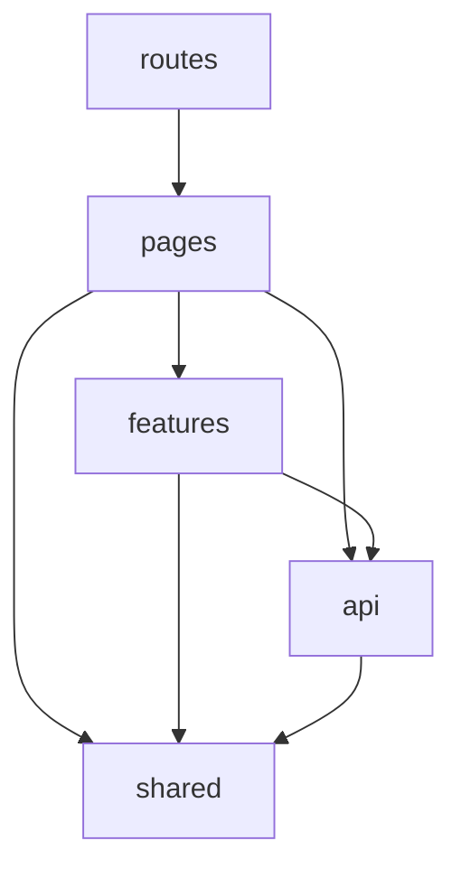
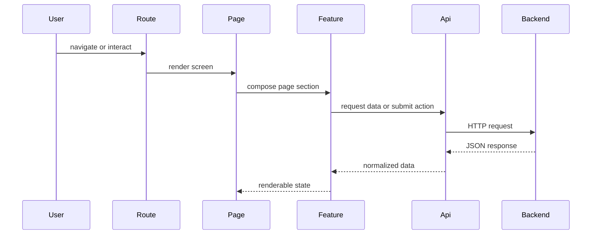

# BruinNest Frontend Architecture

## 1. Document Purpose

This document defines the frontend architecture for the BruinNest MVP. It is intended to serve as the internal implementation guide for the team after the MVP API specification has been finalized.

The scope of this document covers the frontend implementation of `US-1` through `US-5`:

- account registration and login
- profile creation and update
- browse and search
- roommate detail page
- direct messaging

This document focuses on internal frontend structure rather than backend endpoint behavior. External request and response contracts are defined in `bruinnest-mvp-api-spec.md`.

## 2. Architecture Goals

The frontend architecture should satisfy the following goals:

1. Keep routing, page composition, UI rendering, and network requests clearly separated.
2. Make it easy for multiple teammates to work on different frontend modules at the same time.
3. Keep the codebase simple enough for an MVP while leaving room for later expansion.
4. Support stable internal module boundaries so UI and data-fetching details can evolve without affecting unrelated parts of the app.
5. Match the current stack choice: `React`, `Vite`, `JavaScript`, `React Router`, and `fetch`.

## 3. Layered Architecture

The frontend uses a layered structure based on five logical parts:

1. `routes`
2. `pages`
3. `features`
4. `api`
5. `shared`

This structure keeps page-level behavior separate from reusable UI and keeps HTTP requests out of page components as much as possible.

### 3.1 Layer Responsibilities

#### `routes`

Purpose:

- define application routes
- map URLs to page components
- apply route guards where needed

Rules:

- do not place API requests directly here
- do not implement business-specific UI logic here

#### `pages`

Purpose:

- assemble feature sections and shared components into a screen
- own page-level state such as loading, error, search inputs, and modal visibility
- trigger API calls through feature modules or API wrappers

Rules:

- pages should not duplicate reusable UI
- pages should not contain low-level `fetch` code
- pages should remain focused on screen composition and page behavior

#### `features`

Purpose:

- group UI and interaction logic by domain
- contain reusable feature-specific components and helpers
- reduce duplication across pages in the same domain

Examples:

- auth forms
- profile editor
- browse filter panel
- conversation list
- message composer

Rules:

- features may depend on shared UI and API modules
- features should not directly manage global routing configuration

#### `api`

Purpose:

- isolate all backend requests behind a stable wrapper layer
- normalize request options, response parsing, and error handling
- provide a single place to change transport details later

Rules:

- page components should not call `fetch` inline
- API modules should not render UI
- API modules should return plain JavaScript objects or throw errors

#### `shared`

Purpose:

- hold reusable UI primitives and common utilities
- provide layout components, common helpers, and app-level state containers if needed

Examples:

- navigation bar
- route guard wrapper
- loading state components
- error message components
- date formatting helpers

Rules:

- shared modules should stay generic and reusable
- shared UI should not depend on feature-specific assumptions

## 4. Dependency Direction

Dependencies should flow in one direction only:



Allowed dependencies:

- `routes -> pages`
- `pages -> features`
- `pages -> api`
- `pages -> shared`
- `features -> api`
- `features -> shared`
- `api -> shared/utils`

Disallowed dependencies:

- `api -> pages`
- `api -> features`
- `shared -> pages`
- `shared -> features`
- `routes -> api` for endpoint logic

## 5. Recommended Directory Structure

```text
client/
├── src/
│   ├── main.jsx
│   ├── App.jsx
│   ├── routes/
│   │   ├── AppRouter.jsx
│   │   ├── ProtectedRoute.jsx
│   │   └── PublicRoute.jsx
│   ├── pages/
│   │   ├── LoginPage.jsx
│   │   ├── RegisterPage.jsx
│   │   ├── ProfileSetupPage.jsx
│   │   ├── BrowsePage.jsx
│   │   ├── ProfileDetailPage.jsx
│   │   └── MessagesPage.jsx
│   ├── features/
│   │   ├── auth/
│   │   │   ├── components/
│   │   │   └── authHelpers.js
│   │   ├── profile/
│   │   │   ├── components/
│   │   │   └── profileHelpers.js
│   │   ├── browse/
│   │   │   ├── components/
│   │   │   └── browseHelpers.js
│   │   └── messages/
│   │       ├── components/
│   │       └── messageHelpers.js
│   ├── lib/
│   │   ├── api/
│   │   │   ├── client.js
│   │   │   ├── auth.js
│   │   │   ├── profile.js
│   │   │   └── messages.js
│   │   └── utils/
│   │       ├── date.js
│   │       ├── form.js
│   │       └── storage.js
│   ├── shared/
│   │   ├── components/
│   │   │   ├── AppLayout.jsx
│   │   │   ├── Navbar.jsx
│   │   │   ├── LoadingState.jsx
│   │   │   ├── ErrorState.jsx
│   │   │   └── EmptyState.jsx
│   │   └── context/
│   │       └── AuthContext.jsx
│   └── styles/
│       └── index.css
```

## 6. Module Responsibilities

## 6.1 Auth Module

Files:

- `pages/LoginPage.jsx`
- `pages/RegisterPage.jsx`
- `features/auth/components/*`
- `lib/api/auth.js`
- `shared/context/AuthContext.jsx`

Responsibilities:

- render registration and login flows
- store current authenticated user state
- handle protected-route checks
- redirect users based on authentication or profile completion status

Frontend rules owned by this module:

- login and registration forms should validate required inputs before submission
- protected pages should not render for unauthenticated users
- authentication state should be reloaded from the backend when the app initializes

## 6.2 Profile Module

Files:

- `pages/ProfileSetupPage.jsx`
- `pages/ProfileDetailPage.jsx`
- `features/profile/components/*`
- `features/browse/components/*`
- `lib/api/profile.js`

Responsibilities:

- render profile setup and edit form
- render browse cards and filter UI
- render public profile details
- manage page-level search and filter state

Frontend rules owned by this module:

- browse page should show loading, empty, and error states clearly
- profile edit forms should keep field naming consistent with the API contract
- current user should not appear in their own browse results

## 6.3 Message Module

Files:

- `pages/MessagesPage.jsx`
- `features/messages/components/*`
- `lib/api/messages.js`
- `shared/components/Navbar.jsx`

Responsibilities:

- list conversations
- display chronological message history
- send messages
- poll for new messages and unread counts
- show unread badge in the navigation bar

Frontend rules owned by this module:

- message polling should be isolated to message-related pages or app shell logic
- message list and unread badge should stay in sync with the backend
- sending a message should update the visible thread immediately after a successful response

## 7. Internal Interface Conventions

Internal module interfaces should be documented and kept stable. These are not public backend APIs, but development contracts between frontend modules.

General rules:

1. Pages should receive normalized data from API wrappers or feature helpers, not raw `fetch` calls.
2. Feature components should receive explicit props rather than reading unrelated global state.
3. API modules should return plain objects, arrays, or throw errors.
4. Shared components should stay presentation-oriented unless they are explicitly app-shell components.
5. Route guards should rely on centralized auth state instead of duplicating login checks in every page.

## 8. Export Contracts By Module

The following interfaces define the recommended export surface for core frontend modules.

## 8.1 API Exports

### `lib/api/client.js`

Recommended exports:

- `apiGet(path, options)`
- `apiPost(path, body, options)`
- `apiPut(path, body, options)`
- `apiDelete(path, options)`

Responsibilities:

- set common headers
- include credentials
- parse JSON responses
- normalize error handling

### `lib/api/auth.js`

Recommended exports:

- `registerUser(payload)`
- `verifyRegistration(payload)`
- `loginUser(payload)`
- `logoutUser()`
- `getCurrentUser()`

Return expectations:

- return plain auth-related data objects
- throw errors when request or response handling fails

### `lib/api/profile.js`

Recommended exports:

- `createProfile(payload)`
- `getMyProfile()`
- `updateMyProfile(payload)`
- `getProfiles(params)`
- `getProfileById(userId)`

Return expectations:

- return normalized profile data suitable for page rendering

### `lib/api/messages.js`

Recommended exports:

- `createOrGetConversation(targetUserId)`
- `getConversations()`
- `getConversationMessages(conversationId, afterMessageId)`
- `sendMessage(payload)`
- `markConversationRead(conversationId, lastReadMessageId)`
- `getUnreadSummary()`

Return expectations:

- return normalized conversation and message data
- support polling without leaking transport details into page components

## 8.2 Shared UI Exports

### `shared/context/AuthContext.jsx`

Recommended exports:

- `AuthProvider`
- `useAuth()`

Suggested state:

- `user`
- `profileCompleted`
- `isAuthLoading`
- `refreshAuth()`
- `clearAuth()`

### `routes/ProtectedRoute.jsx`

Recommended responsibility:

- block unauthenticated access to protected pages
- redirect unauthenticated users to the login page

### `shared/components/Navbar.jsx`

Recommended props or state dependencies:

- current user state
- unread message count
- navigation actions

## 9. State Management Strategy

The MVP does not use `TanStack Query`, `Redux`, or another external state-management library.

Recommended state strategy:

- use local component state for page-specific UI state
- use shared context only for cross-page app state such as authenticated user
- keep server data access behind API modules
- avoid storing duplicated copies of the same server data in many places

This keeps the MVP simple while allowing a future migration to a more advanced data-fetching library.

## 10. Data Fetching Strategy

The frontend should use `fetch` through wrapper modules rather than inline requests.

Recommended rule:

- pages trigger data loads
- API wrappers perform the request
- pages and feature components consume the parsed result

Examples:

- login page calls `loginUser`
- browse page calls `getProfiles`
- messages page calls `getConversations` and `getConversationMessages`

This design keeps future transport changes localized. If the project later adopts `axios`, `TanStack Query`, or WebSocket subscriptions, the API boundary can remain stable.

## 11. Request Flow

The expected frontend request flow is:



## 12. Validation Strategy

Validation should happen at two levels:

- UI validation for required fields and basic format checks
- backend validation for final enforcement

Recommended rule:

- frontend validation improves usability
- backend validation remains the source of truth

Examples:

- empty login form: frontend should block submission
- malformed email: frontend may show immediate feedback
- duplicate email or invalid verification code: backend determines final result

## 13. Naming Conventions

Use the following conventions consistently:

- route files: `AppRouter.jsx`, `ProtectedRoute.jsx`
- page files: `LoginPage.jsx`, `BrowsePage.jsx`
- shared UI components: `Navbar.jsx`, `LoadingState.jsx`
- API files: `auth.js`, `profile.js`, `messages.js`

Function naming:

- page handlers: verb-based and UI-oriented
  - `handleSubmit`
  - `handleSearch`
  - `handleSendMessage`
- API functions: action-oriented
  - `loginUser`
  - `getProfiles`
  - `sendMessage`
- context helpers: state-oriented
  - `refreshAuth`
  - `clearAuth`

## 14. Implementation Order

Recommended frontend build order:

1. app shell and router setup
2. auth pages and auth context
3. profile setup page
4. browse and search page
5. profile detail page
6. messages page and unread badge polling

This order matches the MVP dependency chain and keeps the UI build aligned with backend availability.

## 15. Team Coordination Notes

For team collaboration, each feature area should be implemented against the agreed frontend module exports before integration starts.

Recommended practice:

1. freeze API wrapper function names before page implementation begins
2. assign frontend work by feature area, not by arbitrary component count
3. avoid duplicating fetch logic in multiple pages
4. keep reusable UI in `shared` instead of copying markup between pages
5. keep route protection logic centralized

## 16. Summary

The recommended frontend structure for the BruinNest MVP is:

- `routes` for navigation structure
- `pages` for screen composition
- `features` for domain-specific UI and interaction logic
- `api` for backend communication
- `shared` for reusable UI and common state

This architecture is simple enough for the MVP, clear enough for team collaboration, and extensible enough for later features beyond `US-1` through `US-5`.
