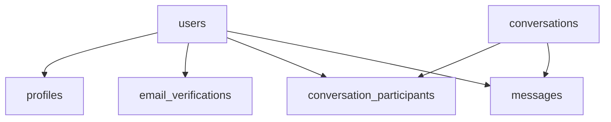

# BruinNest MVP Database Specification

## 1. Document Purpose

This document defines the database specification for the BruinNest MVP. It covers the persistent data model for `US-1` through `US-5`:

- account registration and login
- profile creation and update
- browse and search
- roommate detail page
- direct messaging

This document focuses on schema-level design decisions, entity relationships, and persistence rules. External API contracts are defined separately in `bruinnest-mvp-api-spec.md`.

## 2. Scope

### 2.1 Included in MVP

The MVP database supports the following functional areas:

1. account identity and authentication state
2. registration verification codes
3. public roommate profiles
4. browse/search eligibility
5. one-to-one conversations
6. message history
7. unread message tracking

### 2.2 Deferred Beyond MVP

The following features are intentionally excluded from the current data model:

- housing platform integration
- housing unit linkage
- compatibility questionnaire
- compatibility scoring
- favorites
- notification center
- group matching
- roommate agreement generation
- map-related features

The schema is designed so these features can be added later without replacing the core account, profile, and messaging structure.

## 3. Technical Context

The database layer assumes the following stack:

- `SQLite`
- `better-sqlite3`
- backend runtime: `Node.js + Express`

The schema should remain simple, explicit, and easy to maintain for a course project while still supporting future expansion.

## 4. Design Principles

The MVP database follows these principles:

1. Separate account identity from public profile data.
2. Keep browse visibility explicit through a dedicated completion flag.
3. Model messaging through conversations and participants instead of storing direct user-to-user message pairs only.
4. Keep persistence logic compatible with polling now and WebSocket later.
5. Avoid premature tables for deferred features.

## 5. Table Overview

The MVP database includes the following tables:

- `users`
- `email_verifications`
- `profiles`
- `conversations`
- `conversation_participants`
- `messages`

## 6. Table Specifications

### 6.1 `users`

Purpose: stores account identity and authentication state.

Fields:

- `id` INTEGER PRIMARY KEY
- `email` TEXT NOT NULL UNIQUE
- `password_hash` TEXT NOT NULL
- `is_verified` INTEGER NOT NULL DEFAULT 0
- `created_at` TEXT NOT NULL
- `updated_at` TEXT NOT NULL

Notes:

- This table should remain authentication-focused.
- Public profile fields must not be stored here.
- Passwords must never be stored in plaintext.

### 6.2 `email_verifications`

Purpose: stores registration verification data and resend timing.

Fields:

- `id` INTEGER PRIMARY KEY
- `email` TEXT NOT NULL
- `code_hash` TEXT NOT NULL
- `expires_at` TEXT NOT NULL
- `sent_at` TEXT NOT NULL
- `consumed_at` TEXT NULL

Notes:

- Verification codes should be stored as hashes.
- The most recent unconsumed row for a given email is used during verification.
- Resend cooldown is enforced using `sent_at`.

### 6.3 `profiles`

Purpose: stores the public roommate profile shown in browse and detail pages.

Fields:

- `id` INTEGER PRIMARY KEY
- `user_id` INTEGER NOT NULL UNIQUE
- `display_name` TEXT NOT NULL
- `gender` TEXT NOT NULL
- `graduation_year` INTEGER NOT NULL
- `budget_min` INTEGER NOT NULL
- `budget_max` INTEGER NOT NULL
- `move_in_date` TEXT NOT NULL
- `bio` TEXT NOT NULL
- `profile_completed` INTEGER NOT NULL DEFAULT 0
- `created_at` TEXT NOT NULL
- `updated_at` TEXT NOT NULL

Notes:

- `profile_completed` controls browse and search eligibility.
- `user_id` is a one-to-one reference to the account owner.
- Later profile extensions can be added here without changing the `users` table.

### 6.4 `conversations`

Purpose: stores a message thread.

Fields:

- `id` INTEGER PRIMARY KEY
- `created_at` TEXT NOT NULL
- `updated_at` TEXT NOT NULL

Notes:

- The MVP supports only one-to-one conversations, but this table remains generic so later group chat can be added if needed.

### 6.5 `conversation_participants`

Purpose: maps users to conversations and tracks read state.

Fields:

- `id` INTEGER PRIMARY KEY
- `conversation_id` INTEGER NOT NULL
- `user_id` INTEGER NOT NULL
- `last_read_message_id` INTEGER NULL
- `joined_at` TEXT NOT NULL

Constraints:

- UNIQUE (`conversation_id`, `user_id`)

Notes:

- Each MVP conversation should have exactly two participants.
- `last_read_message_id` supports unread-count calculation and later real-time delivery upgrades.

### 6.6 `messages`

Purpose: stores message history for each conversation.

Fields:

- `id` INTEGER PRIMARY KEY
- `conversation_id` INTEGER NOT NULL
- `sender_user_id` INTEGER NOT NULL
- `body` TEXT NOT NULL
- `created_at` TEXT NOT NULL

Notes:

- Messages must be returned chronologically.
- Each message belongs to exactly one conversation.

## 7. Relationship Summary

## 8. Core Data Rules

### 8.1 Account and Profile Separation

Authentication-related data lives in `users`. Public profile data lives in `profiles`. This separation keeps authentication logic isolated and makes profile evolution easier.

### 8.2 Browse Eligibility

A user appears in browse and search results only when all of the following are true:

- the account exists
- the account is verified
- a profile exists
- `profile_completed = 1`

This rule should be enforced by backend query logic, not just by frontend behavior.

### 8.3 Conversation Ownership

A user may access a conversation only if a matching row exists in `conversation_participants`.

### 8.4 Unread Tracking

Unread state is tracked per participant through `last_read_message_id`. This allows the system to support:

- per-conversation unread counts
- total unread summary for the navigation bar
- incremental polling
- later transport upgrades without changing the storage model

## 9. Extensibility Notes

The MVP intentionally leaves the following extension points open:

1. housing-related fields can be added later without redesigning account or message tables
2. questionnaire and scoring can be implemented as separate tables
3. notification-related tables can be introduced independently
4. conversation structure is already compatible with potential group messaging

## 10. Implementation Notes

When the team creates the SQL schema, the following should be reflected clearly:

- explicit uniqueness for account email
- explicit uniqueness for `profiles.user_id`
- explicit uniqueness for `conversation_participants (conversation_id, user_id)`
- consistent timestamp format across all tables
- indexes added where search or lookup frequency justifies them

## 11. Summary

The BruinNest MVP database model is centered on three stable domains:

- accounts
- profiles
- messaging

This structure is intentionally narrow enough for the MVP and stable enough to support later features without rewriting the main persistence layer.
